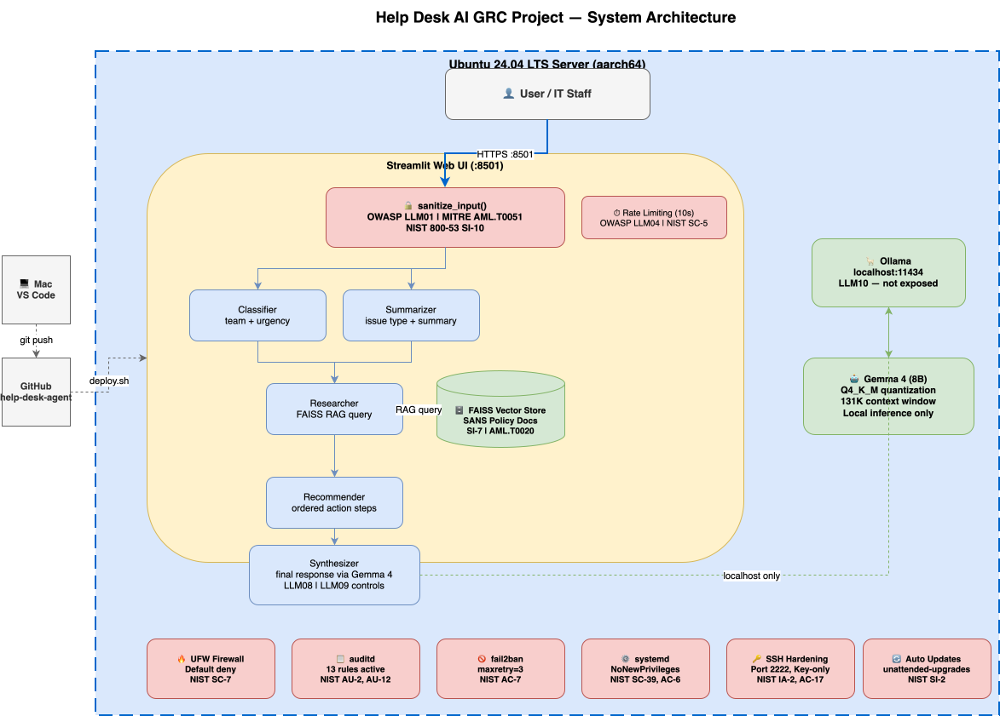

# 🔐 Help Desk AI GRC Engineering Project

> A hands-on GRC engineering project demonstrating the secure deployment of a locally-hosted AI agent using NIST AI RMF, NIST 800-53, NIST 800-37, MITRE ATLAS, and OWASP LLM Top 10.

---

## 📌 Project Overview

This project documents the end-to-end process of deploying a secure, production-hardened **IT Help Desk AI Triage Agent** on an Ubuntu 24.04 LTS server. Every infrastructure and AI security decision is mapped to a recognized GRC framework control, making this a living security plan — not just a technical deployment.

The agent uses a LangGraph multi-agent pipeline with FAISS RAG over SANS security policy documents to triage IT support tickets — classifying, summarizing, researching, and synthesizing structured responses in real time.

> **Agent code repository:** [help-desk-agent](https://github.com/LesCondones/help-desk-agent)

---

## 🏗️ Architecture



**Stack:**
- OS: Ubuntu 24.04.4 LTS (aarch64)
- AI Framework: LangGraph + LangChain + FAISS
- Model: Gemma 4 8B (via Ollama, local inference only)
- UI: Streamlit
- Process Manager: systemd
- Firewall: UFW
- CI/CD: GitHub → deploy.sh

---

## 🛡️ Security Frameworks Applied

| Framework | Purpose | Phases |
|---|---|---|
| NIST 800-53 Rev 5 | Security control catalog — server and application hardening | 1, 2, 3 |
| NIST 800-37 Rev 2 | Risk Management Framework — categorize, select, implement, assess | All |
| NIST AI RMF 1.0 | AI-specific risk governance — Govern, Map, Measure, Manage | 2, 3 |
| MITRE ATLAS | Adversarial ML threat modeling | 3 |
| OWASP LLM Top 10 | AI application vulnerability assessment | 2, 3 |

---

## 📋 Phase 1 — Server Setup & Hardening ✅

### Objective
Establish a secure, auditable Ubuntu server baseline before deploying any application code.

### Automation
Phase 1 is fully automated via `scripts/phase1-hardening.sh`:
- Validates SSH key is present before disabling password auth (lockout prevention)
- Fixes Ubuntu 24.04 cloud-init SSH override automatically
- Configures UFW, auditd, fail2ban, and unattended-upgrades
- Runs a full verification check at the end

### NIST 800-53 Controls Implemented

| Control ID | Control Name | Implementation |
|---|---|---|
| SI-2 | Flaw Remediation | `apt upgrade`, unattended-upgrades |
| CM-2 | Baseline Configuration | Automated via `phase1-hardening.sh` |
| CM-3 | Configuration Change Control | All changes tracked, temp rules reverted |
| CM-6 | Configuration Settings | SSH hardening drop-in config |
| AC-3 | Access Enforcement | SSH key-only auth, AllowUsers directive |
| AC-6 | Least Privilege | Non-root user, systemd sandboxing |
| AC-7 | Unsuccessful Login Attempts | fail2ban maxretry=3, bantime=3600s |
| AC-8 | System Use Notification | SSH legal notice banner |
| AC-17 | Remote Access | SSH on port 2222, ED25519 key auth |
| AU-2 | Event Logging | auditd with 13-rule custom ruleset |
| AU-12 | Audit Record Generation | Tracks identity, sudo, exec, network changes |
| IA-2 | Identification & Authentication | ED25519 SSH key, no password auth | ✅ |
| IA-5 | Authenticator Management | Key passphrase required |
| SC-7 | Boundary Protection | UFW default deny, explicit allow rules |
| SC-8  | Transmission Confidentiality | Caddy reverse proxy, self-signed TLS cert | ✅ |
| SC-39 | Process Isolation | systemd NoNewPrivileges, PrivateTmp |

---

## 📋 Phase 2 — AI Agent Deployment ✅

### Objective
Deploy the Help Desk AI Triage Agent as a hardened, persistent systemd service with CI/CD pipeline.

### Agent Pipeline
The agent uses a **LangGraph StateGraph** with 5 specialized nodes:

```
START ─┬─> classifier  (team + urgency)
       │
       └─> summarizer  (issue type + summary)
                │
           researcher  (FAISS RAG over SANS policies)
                │
           recommender (ordered action steps)
                │
           synthesizer (final structured response via Gemma 4)
                │
               END
```

### CI/CD Pipeline
```
VS Code (Mac) → git push → GitHub → ssh helpdesk-ai-server "~/deploy.sh"
```
Maps to **NIST 800-53 CM-3, SA-10**.

### systemd Security Hardening
- `NoNewPrivileges=yes` — prevents privilege escalation
- `PrivateTmp=yes` — isolated temp directory
- `ProtectSystem=strict` — read-only system paths
- `ReadWritePaths` — limited to agent directory only

---

## 📋 Phase 3 — Framework Mapping & Controls ✅

### NIST AI RMF (All 4 Functions Completed)

| Function | Description | Document |
|---|---|---|
| GOVERN | AI risk policies, accountability, risk tolerance, human oversight | `docs/ai-rmf/govern.md` |
| MAP | 14 risks identified across 6 attack surfaces via code review | `docs/ai-rmf/map.md` |
| MEASURE | Live test evidence — injection tests, FAISS integrity baseline | `docs/ai-rmf/measure.md` |
| MANAGE | Risk treatment decisions, incident response plan, monitoring | `docs/ai-rmf/manage.md` |

### MITRE ATLAS Threat Model
10 adversarial ML techniques assessed across 5 tactics:

| Technique | Tactic | Status |
|---|---|---|
| AML.T0051 Prompt Injection | ML Attack Staging | ✅ Mitigated |
| AML.T0054 Indirect Injection | ML Attack Staging | ✅ Mitigated |
| AML.T0020 Data Poisoning | Impact | ✅ Mitigated |
| AML.T0048 Erroneous Recommendations | Impact | ✅ Mitigated |
| AML.T0029 Denial of ML Service | Impact | ✅ Mitigated |
| AML.T0015 Evade ML Model | Defense Evasion | ✅ Mitigated |
| AML.T0049 Obfuscated Prompts | Defense Evasion | ✅ Mitigated |
| AML.T0000 Active Scanning | Reconnaissance | ✅ Mitigated |
| AML.T0044 Invert ML Model | Exfiltration | ✅ Accepted |
| AML.T0057 LLM Data Leakage | Exfiltration | ✅ Accepted |

Full document: `docs/threat-model/mitre-atlas.md`

### OWASP LLM Top 10 Assessment
**Result: 7 Green / 3 Yellow / 0 Red**

| # | Risk | Status |
|---|---|---|
| LLM01 | Prompt Injection | 🟡 Medium — sanitizer implemented, gaps remain |
| LLM02 | Insecure Output Handling | 🟢 Low — Streamlit markdown sanitizes HTML |
| LLM03 | Training Data Poisoning | 🟢 Low — FAISS integrity monitoring active |
| LLM04 | Model Denial of Service | 🟡 Medium — per-session rate limiting |
| LLM05 | Supply Chain Vulnerabilities | 🟢 Low — uv.lock, trusted sources |
| LLM06 | Sensitive Information Disclosure | 🟢 Low — local model, no PII |
| LLM07 | Insecure Plugin Design | 🟢 Low — no plugins |
| LLM08 | Excessive Agency | 🟢 Low — advisory only, human oversight |
| LLM09 | Overreliance | 🟡 Medium — disclaimer added, no confidence scoring |
| LLM10 | Model Theft | 🟢 Low — Ollama localhost only |

Full document: `docs/owasp/llm-top10.md`

---

## 📋 Phase 5 — Hardening & Monitoring ✅

### Security Hardening
- Unicode normalization + Base64 detection in input sanitizer
- Server-side rate limiting replacing per-session limiting
- Sequential LangGraph pipeline — eliminates parallel Ollama conflicts
- Retry logic + fallback defaults for JSON parsing (MAP-007, MAP-008)
- PasswordAuthentication disabled in cloud-init SSH override
- Port 22 permanently closed from UFW
- Caddy reverse proxy with TLS — NIST 800-53 SC-8

### Monitoring
- Daily health check script with cron job (6am UTC)
- Log rotation configured — weekly, 4 weeks retention
- gemma4 removed — disk reduced from 84% to 50%
- 7 security updates applied

---

## 📊 Risk Register

| ID | Risk | Likelihood | Impact | Control | Status |
|---|---|---|---|---|---|
| R-001 | Unauthorized SSH access | High | High | fail2ban, key-only auth | ✅ Mitigated |
| R-002 | Privilege escalation | Medium | High | auditd sudoers watch | ✅ Monitored |
| R-003 | Unpatched OS vulnerabilities | Medium | High | unattended-upgrades | ✅ Mitigated |
| R-004 | Unauthorized network access | High | High | UFW default deny | ✅ Mitigated |
| R-005 | Prompt injection attack | High | High | sanitize_input(), structured pipeline | ✅ Mitigated |
| R-006 | Sensitive data leakage | Medium | High | Local model, no external calls | ✅ Mitigated |
| R-007 | Model theft | Low | High | Ollama localhost only | ✅ Mitigated |
| R-008 | RAG/data poisoning | Low | High | FAISS integrity hash monitoring | ✅ Monitored |
| R-009 | DoS via ticket flooding | Medium | High | Server-side rate limiting + Caddy connection limiting | ✅ Mitigated |
| R-010 | Unicode/encoded injection | Medium | Medium | Unicode normalization + Base64 detection implemented | ✅ Mitigated |
| R-011 | Unencrypted data in transit | Medium | High | Caddy reverse proxy with TLS (SC-8) | ✅ Mitigated |
| R-012 | Temporary UFW port 22 left open | High | High | Port 22 closed, SSH on 2222 only | ✅ Mitigated |
| R-013 | GRC agent unauthorized write access | Medium | High | Agent scoped to helpdesk-ai-grc repo only, read/write limited to .md files | ✅ Mitigated |

---

## 🗂️ Repository Structure

```
helpdesk-ai-grc/
├── README.md
├── scripts/
│   ├── phase1-hardening.sh       # Automated Phase 1 OS hardening
│   ├── setup-vm.sh               # VM creation script (VMware Fusion ARM)
│   └── deploy.sh                 # CI/CD deploy script
├── configs/
│   ├── ssh/
│   │   └── 99-hardening.conf     # SSH hardening drop-in config
│   ├── audit/
│   │   └── hardening.rules       # auditd custom ruleset
│   ├── fail2ban/
│   │   └── jail.local            # fail2ban SSH jail config
│   └── helpdesk-agent.service    # systemd service definition
└── docs/
    ├── ai-rmf/
    │   ├── govern.md             # NIST AI RMF GOVERN function
    │   ├── map.md                # NIST AI RMF MAP function
    │   ├── measure.md            # NIST AI RMF MEASURE function
    │   └── manage.md             # NIST AI RMF MANAGE function
    ├── threat-model/
    │   └── mitre-atlas.md        # MITRE ATLAS threat model
    └── owasp/
        └── llm-top10.md          # OWASP LLM Top 10 assessment
```

---

## 🚀 Quick Start

### Prerequisites
- VMware Fusion 13+ (Apple Silicon) or any hypervisor
- Ubuntu 24.04 LTS Server ARM ISO
- SSH key pair on host machine
- [help-desk-agent](https://github.com/LesCondones/help-desk-agent) code

### 1. Create the VM
```bash
chmod +x scripts/setup-vm.sh
./scripts/setup-vm.sh
```

### 2. Install Ubuntu
During install: create `grcadmin` user, enable OpenSSH, use LVM storage.

### 3. Copy SSH key and run hardening
```bash
ssh-copy-id -i ~/.ssh/YOUR_KEY.pub -p 22 grcadmin@YOUR_VM_IP
scp -P 22 scripts/phase1-hardening.sh grcadmin@YOUR_VM_IP:~/
ssh -p 22 grcadmin@YOUR_VM_IP "chmod +x phase1-hardening.sh && sudo ./phase1-hardening.sh"
```

### 4. Deploy the agent
```bash
# On the VM
curl -LsSf https://astral.sh/uv/install.sh | sh
curl -fsSL https://ollama.com/install.sh | sh
ollama pull gemma4
git clone https://github.com/LesCondones/help-desk-agent.git ~/helpdesk-agent
cd ~/helpdesk-agent && uv sync
sudo systemctl enable helpdesk-agent && sudo systemctl start helpdesk-agent
```

### 5. Deploy updates (CI/CD)
```bash
# From your Mac after pushing to GitHub
ssh helpdesk-ai-server "~/deploy.sh"
```

---

## 🔗 Frameworks & References

- [NIST AI RMF 1.0](https://www.nist.gov/artificial-intelligence/ai-risk-management-framework)
- [NIST SP 800-53 Rev 5](https://csrc.nist.gov/publications/detail/sp/800-53/rev-5/final)
- [NIST SP 800-37 Rev 2](https://csrc.nist.gov/publications/detail/sp/800-37/rev-2/final)
- [MITRE ATLAS](https://atlas.mitre.org/)
- [OWASP LLM Top 10](https://owasp.org/www-project-top-10-for-large-language-model-applications/)
- [SANS Policy Templates](https://www.sans.org/information-security-policy/)

---

## 👤 Author

**LesCondones**  
GRC Engineering Project | 2026  
[GitHub](https://github.com/LesCondones)
