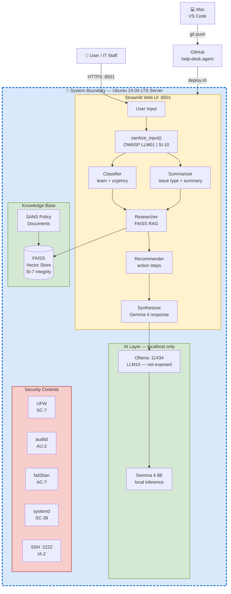

# NIST AI RMF — MAP Function
## Help Desk AI Triage Agent

**Document Type:** AI Risk Identification & Categorization  
**Framework:** NIST AI Risk Management Framework (AI RMF 1.0)  
**Function:** MAP  
**System:** Help Desk AI Triage Agent  
**Date:** 2026-05-06  
**Status:** Implemented  

---

## Overview

The MAP function identifies and categorizes AI risks before they are measured
or managed. It establishes the context in which the AI system operates,
catalogs the risk sources, and maps each risk to its potential impact.

MAP answers: *what risks exist, where do they come from, and what is their
potential impact on the organization and its users?*

---

## System Context

### AI System Description

| Attribute | Value |
|---|---|
| System name | Help Desk AI Triage Agent |
| AI type | Retrieval-Augmented Generation (RAG) + Multi-agent pipeline |
| Model | Gemma 4 (local inference via Ollama) |
| Framework | LangGraph StateGraph |
| Interface | Streamlit web UI |
| Knowledge base | FAISS vector store over SANS policy PDFs |
| Deployment | Ubuntu 24.04 LTS, systemd service |
| Users | IT staff and end users submitting support tickets |

### System Boundary

```



### Trust Boundaries

| Boundary | Description | Risk Level |
|---|---|---|
| User input → Pipeline | Unvalidated text from any user | High |
| Pipeline → Gemma 4 | Prompt constructed from user input | High |
| FAISS index → Pipeline | Deserialized vector store from disk | Medium |
| Ollama → Pipeline | JSON response parsed without schema validation | Medium |
| Systemd → OS | Agent runs as grcadmin user | Low |

---

## Risk Identification

### Risk Source 1 — User Input (Ticket Text)

**Location in code:** `app.py` → `run_triage()` → `agent.py` → `tools.py`

**Risk:** Raw user input is passed directly into all five pipeline nodes
without sanitization or validation. The ticket text reaches the model
as-is via `_chat_json()`.

```python
# tools.py — no sanitization before model call
def _chat_json(system_prompt: str, user_content: str) -> dict:
    response = ollama.chat(
        model=MODEL,
        messages=[
            {"role": "system", "content": system_prompt},
            {"role": "user", "content": user_content},
        ],
    )
```

**Identified Risks:**

| Risk ID | Risk | Framework | Likelihood | Impact |
|---|---|---|---|---|
| MAP-001 | Prompt injection via ticket text | OWASP LLM01, MITRE AML.T0051 | High | High |
| MAP-002 | Jailbreak attempt to extract system prompts | OWASP LLM01 | Medium | Medium |
| MAP-003 | Social engineering via crafted ticket | MITRE AML.T0051 | Medium | Medium |

---

### Risk Source 2 — FAISS Vector Store Deserialization

**Location in code:** `rag.py` → `load_vector_store()`

**Risk:** The FAISS index is loaded with `allow_dangerous_deserialization=True`.
This flag bypasses LangChain's safety check for pickle-based deserialization.
A compromised or tampered `index.pkl` file could execute arbitrary code on load.

```python
# rag.py — dangerous deserialization flag enabled
def load_vector_store():
    embeddings = OllamaEmbeddings(model=EMBEDDING_MODEL)
    return FAISS.load_local(
        VECTOR_STORE_DIR,
        embeddings,
        allow_dangerous_deserialization=True  # <-- risk
    )
```

**Identified Risks:**

| Risk ID | Risk | Framework | Likelihood | Impact |
|---|---|---|---|---|
| MAP-004 | Arbitrary code execution via tampered index.pkl | MITRE AML.T0020 | Low | Critical |
| MAP-005 | RAG poisoning via modified policy documents | MITRE AML.T0020 | Low | High |
| MAP-006 | Knowledge base integrity loss | NIST 800-53 SI-7 | Low | High |

---

### Risk Source 3 — JSON Parsing Without Schema Validation

**Location in code:** `tools.py` → `_chat_json()`

**Risk:** Model output is parsed directly with `json.loads()` after
stripping markdown fences. No schema validation is performed. If the
model returns malformed JSON or unexpected fields, the pipeline crashes
or silently produces incorrect results.

```python
# tools.py — no schema validation after parse
return json.loads(_extract_json(response["message"]["content"]))
```

**Identified Risks:**

| Risk ID | Risk | Framework | Likelihood | Impact |
|---|---|---|---|---|
| MAP-007 | Pipeline crash from malformed model output | OWASP LLM02 | Medium | Medium |
| MAP-008 | Silent data corruption from unexpected JSON fields | OWASP LLM02 | Medium | Medium |

---

### Risk Source 4 — No Rate Limiting on Ticket Submission

**Location in code:** `app.py` — Streamlit chat input, no throttling

**Risk:** Any user can submit unlimited tickets through the Streamlit UI.
Each ticket triggers five Gemma 4 inference calls. High-volume submission
could exhaust system resources and make the agent unavailable.

**Identified Risks:**

| Risk ID | Risk | Framework | Likelihood | Impact |
|---|---|---|---|---|
| MAP-009 | Denial of service via ticket flooding | OWASP LLM04, NIST 800-53 SC-5 | Medium | High |
| MAP-010 | Resource exhaustion crashing Ollama | OWASP LLM04 | Medium | High |

---

### Risk Source 5 — Model Behavior & Hallucination

**Location in code:** `agent.py` → `_synthesizer_node()`

**Risk:** Gemma 4 may generate plausible-sounding but factually incorrect
IT guidance, especially for edge cases not covered by the knowledge base.
Users may act on incorrect advice.

**Identified Risks:**

| Risk ID | Risk | Framework | Likelihood | Impact |
|---|---|---|---|---|
| MAP-011 | Hallucinated policy guidance | NIST AI RMF MAP-5, OWASP LLM02 | Medium | High |
| MAP-012 | Overconfident response on unknown issues | NIST AI RMF GOVERN G2 | Medium | Medium |

---

### Risk Source 6 — Embedding Model Dependency

**Location in code:** `rag.py` — `nomic-embed-text` via Ollama

**Risk:** The RAG pipeline depends on the `nomic-embed-text` embedding model
being available in Ollama. If the model is missing or updated, the vector
store query fails silently or produces degraded results.

**Identified Risks:**

| Risk ID | Risk | Framework | Likelihood | Impact |
|---|---|---|---|---|
| MAP-013 | RAG failure from missing embedding model | NIST 800-53 CP-10 | Low | High |
| MAP-014 | Degraded retrieval from embedding model version change | NIST AI RMF MAP-5 | Low | Medium |

---

## Consolidated Risk Map

| Risk ID | Risk Description | Source | Framework | Likelihood | Impact | Priority |
|---|---|---|---|---|---|---|
| MAP-001 | Prompt injection via ticket text | User input | OWASP LLM01 | High | High | 🔴 Critical |
| MAP-004 | Code execution via tampered index.pkl | FAISS deserialization | MITRE AML.T0020 | Low | Critical | 🔴 Critical |
| MAP-009 | Denial of service via ticket flooding | No rate limiting | OWASP LLM04 | Medium | High | 🟠 High |
| MAP-011 | Hallucinated policy guidance | Model behavior | OWASP LLM02 | Medium | High | 🟠 High |
| MAP-005 | RAG poisoning via modified docs | FAISS index | MITRE AML.T0020 | Low | High | 🟠 High |
| MAP-007 | Pipeline crash from malformed output | JSON parsing | OWASP LLM02 | Medium | Medium | 🟡 Medium |
| MAP-002 | Jailbreak attempt | User input | OWASP LLM01 | Medium | Medium | 🟡 Medium |
| MAP-010 | Resource exhaustion crashing Ollama | No rate limiting | OWASP LLM04 | Medium | High | 🟠 High |
| MAP-006 | Knowledge base integrity loss | FAISS index | NIST 800-53 SI-7 | Low | High | 🟠 High |
| MAP-008 | Silent data corruption from bad JSON | JSON parsing | OWASP LLM02 | Medium | Medium | 🟡 Medium |
| MAP-012 | Overconfident response on unknown issues | Model behavior | AI RMF GOVERN G2 | Medium | Medium | 🟡 Medium |
| MAP-013 | RAG failure from missing embedding model | Dependency | NIST 800-53 CP-10 | Low | High | 🟡 Medium |
| MAP-003 | Social engineering via crafted ticket | User input | MITRE AML.T0051 | Medium | Medium | 🟡 Medium |
| MAP-014 | Degraded retrieval from embedding change | Dependency | AI RMF MAP-5 | Low | Medium | 🟢 Low |

---

## Recommended Remediations

### MAP-001 — Prompt Injection (Critical)
Add input sanitization before ticket text reaches the model:
```python
import re

def sanitize_input(text: str) -> str:
    # Remove common injection patterns
    text = re.sub(r'ignore (previous|all|above) instructions?', '', text, flags=re.IGNORECASE)
    text = re.sub(r'you are now', '', text, flags=re.IGNORECASE)
    text = re.sub(r'system prompt', '', text, flags=re.IGNORECASE)
    # Truncate to reasonable ticket length
    return text[:2000].strip()
```

### MAP-004 — FAISS Deserialization (Critical)
Verify integrity of the vector store before loading:
```python
import hashlib

def verify_index_integrity(expected_hash: str) -> bool:
    with open('vector_store/index.pkl', 'rb') as f:
        actual_hash = hashlib.sha256(f.read()).hexdigest()
    return actual_hash == expected_hash
```

### MAP-009 — Rate Limiting (High)
Add per-session rate limiting in `app.py`:
```python
import time

if 'last_submission' not in st.session_state:
    st.session_state.last_submission = 0

if time.time() - st.session_state.last_submission < 10:
    st.warning("Please wait before submitting another ticket.")
    st.stop()

st.session_state.last_submission = time.time()
```

---

## Control Mapping

| Risk ID | AI RMF | NIST 800-53 | MITRE ATLAS | OWASP LLM |
|---|---|---|---|---|
| MAP-001 | MAP 1.1 | SI-10, SI-3 | AML.T0051 | LLM01 |
| MAP-004 | MAP 2.2 | SI-7, CM-3 | AML.T0020 | — |
| MAP-005 | MAP 2.2 | SI-7 | AML.T0020 | — |
| MAP-007 | MAP 1.6 | SI-11 | — | LLM02 |
| MAP-009 | MAP 1.5 | SC-5 | — | LLM04 |
| MAP-011 | MAP 5.1 | SI-12 | — | LLM02 |

---

## Revision History

| Date | Change | Author |
|---|---|---|
| 2026-05-06 | Initial MAP document — all risk sources identified from code review | LesCondones |
